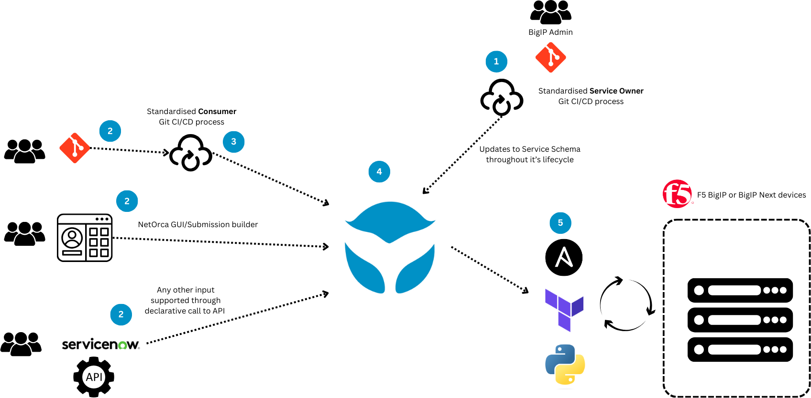

# NetOrca Processing Examples

Welcome! This repository serves as a source of practical examples to help **Service Owner teams** automate service requests using **NetOrca**.

## What is NetOrca?

**NetOrca** is a powerful platform that helps infrastructure and network teams offer their services as reusable, self-service components. This eliminates repetitive manual work and creates a streamlined experience for both service owners and consumers.

With NetOrca you can:

- Define services using standardized JSON Schema
- Allow consumers to request services via GitOps or UI
- Automate approvals and deployments using your existing tools
- Track change requests and current state centrally

NetOrca bridges the gap between *request* and *implementation*, reducing manual work, increasing consistency, and enabling scalable automation across teams.

  

## What You'll Find in This Repository

This repository is organized into key sections to help you get started and build real-world automation workflows:

- **[Basics](./basics/)**  
  Simple, foundational examples that demonstrate the structure of NetOrca validation and deployment flows. Great starting point if you're new to NetOrca.

- **[Examples](./examples/)**  
  Detailed use cases that show how to automate and orchestrate across various platforms, including:
  
  - **F5 BIG-IP**: GTM (DNS), LTM, and WAF deployments and tuning  
  - **Palo Alto Firewalls**: rule management and service delivery  
  - **AWS**: infrastructure and service provisioning
  - **ServiceNow**: standard change integration and lifecycle tracking

  You'll also find more complex multi-platform scenarios, such as:

  - **Three-tier Application Deployment**  
    Example combining AWS EC2 provisioning, ALB configuration, and ServiceNow change tracking—all managed as a single service via NetOrca.

This repository is actively maintained and expanded with new examples to reflect how NetOrca fits into modern infrastructure automation.

**Note:** One of our official examples is also featured in the [F5 DevCentral repository (Level 6)](https://github.com/f5devcentral/bigip-automation/blob/main/level-6/README.md).

## Overview of Automation Workflow

When a consumer submits a request, NetOrca creates a **Service Item**. Each Service Item can generate one or more **Change Instances**, representing specific actions to be taken.

Change Instance types:

- **CREATE** – Initial service deployment
- **MODIFY** – Service update
- **DELETE** – Service removal

### Change Instance Lifecycle

Change Instances go through the following states:

- **PENDING** – Created after passing JSON schema validation
- **APPROVED** – Validated by custom business logic
- **REJECTED** – Failed second-level validation
- **COMPLETED** – Successfully deployed
- **ERRORED** – Failed during deployment

### Automation Phases

NetOrca automation is typically divided into two main phases:

1. **Validation Phase**  
   - Pull all PENDING Change Instances  
   - Perform any required validations (IP conflicts, naming, etc.)  
   - Approve or reject each Change Instance

2. **Deployment Phase**  
   - Deploy all APPROVED Change Instances using Ansible, Terraform, or other tooling  
   - Update status to COMPLETED or ERRORED based on the outcome

Each Service Item can go through this cycle multiple times as it's created, modified, or deleted.

## Getting Started

1. **Explore the Basics**:
   Browse the [basics](./basics/) directory to understand the fundamental patterns for service validation and deployment.

2. **Choose an Example**:
   Find an example in the [examples](./examples/) directory that aligns with your technology stack.

3. **Adapt to Your Environment**:
   Modify the examples with your service details, endpoints, and authentication.

## Contributing

We welcome contributions to expand this repository with more examples and improve existing ones. Please see our [contribution guide](CONTRIBUTING.md) for details.

## Further Reading

- [NetOrca Documentation](https://docs.netorca.io)
- [NetOrca Website](https://netorca.io)
